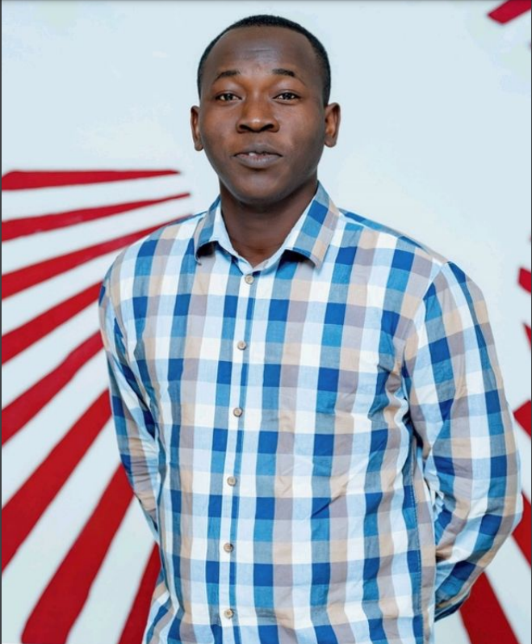

<table style="width:100%; border: none;">
  <tr>
    <td style="width: 25%; vertical-align: top;">
       
      <!-- 
This content is on the left side.
-->
    </td>
    <td style="width: 75%; vertical-align: middle; text-align: center;">
      <h2>Détagnon Bernic GBAGUIDI</h2>
      <a href="https://drive.google.com/file/d/1bibd5lA8wqe9od7XY4CWxa3caT_g-IYa/view?usp=sharing" target="_blank">Loot at my CV</a>
    </td>
  </tr>
</table>

##  Projects

<!--  comment   -->
<table style="width:100%; border: none;">
  <tr> 
  <td style="width: 25%; vertical-align: top;font-weight: bold; background-color: #f0f0f0; color: #333;"> Data Science </td>
   <td style="width: 25%; vertical-align: top;font-weight: bold; background-color: #f0f0f0; color: #333;">Infectious Diseases Modeling </td>
  <td style="width: 25%; vertical-align: top;font-weight: bold; background-color: #f0f0f0; color: #333;"> Large Language Model </td>
  </tr>
  <tr>
    <td style="width: 25%; vertical-align: top;">
      <!--<h2>Data Science</h2>-->
      <ul>
     <li> <a href="https://github.com/Detagnon2000/Machine-Learning/tree/main/SML" target="_blank">Statistical Machine Learning</a></li>
     <li> <a href="https://github.com/Detagnon2000/Machine-Learning/tree/main/Neural%20Network" target="_blank">Neural Network</a></li>
     <li> <a href="https://github.com/Detagnon2000/Machine-Learning/tree/main/Interpretable%20Machine%20Learning" target="_blank">Interpretable Machine Learning </a></li>
        <li> <a href="https://github.com/Detagnon2000/Genomics-and-Bioinformatic" target="_blank">Genomics and Bioinformatic</a></li>
      </ul>
      <!--
This content is on the left side.
-->
    </td>
    <td style="width: 25%; vertical-align: top;">
<!--<h2>Diseases Modeling</h2>-->
      <ul>

<li> <a href="https://z292kc-bernic-gbaguidi.shinyapps.io/Simulation_SIR_model/" target="_blank">Shiny Web App to simulate an SIR Model</a>
       </li>      
      <li> <a href="https://github.com/Detagnon2000/Infectious-Diseases-Modeling/tree/main/Model%20fitting%20with%20frequentist%20approach" target="_blank">Model fitting with frequentist approach</a>
       </li>
        <li> <a href="https://github.com/Detagnon2000/Infectious-Diseases-Modeling/tree/main/Climate%20Model%20(Temp_rainfall)" target="_blank">Climate Model</a>
       </li>
        <li> <a href="https://github.com/Detagnon2000/Infectious-Diseases-Modeling/tree/main/Open%20Malaria" target="_blank">Pratical With OpenMalaria</a>
       </li>
      </ul>
      

    </td>
    <td style="width: 25%; vertical-align: top;">
      <!--<h2>Large Language Model</h2>-->
   <ul>
      <li> <a href="https://huggingface.co/spaces/Detagnon/GB___X4" target="_blank">RAG-Based ChatBot for exam generation(HuggingFace)</a> </li>
     <li> <a href="https://huggingface.co/spaces/Detagnon/Bot_numeriq_2" target="_blank">RAG-Based ChatBot for digital code in Benin(HuggingFace) </a> </li>
    
   </ul>      
      

    </td>
  </tr>
</table>

<h2>Workshop Certificate </h2>

<table style="width:100%; border: none;">
  <tr>
    <td style="width: 25%; vertical-align: top;">
       
      <!-- 
This content is on the left side.
-->
    </td>
    <td style="width: 75%; vertical-align: middle; text-align: center;">
      <h2>Détagnon Bernic GBAGUIDI</h2>
      <a href="https://drive.google.com/file/d/1bibd5lA8wqe9od7XY4CWxa3caT_g-IYa/view?usp=sharing" target="_blank">Loot at my CV</a>
    </td>
  </tr>
</table>

<!--[image](picAIMS.png)

# My CV
Download my CV [here](https://drive.google.com/file/d/1bibd5lA8wqe9od7XY4CWxa3caT_g-IYa/view?usp=sharing)

# Projects

## [Machine Learning](https://github.com/Detagnon2000/Machine-Learning)

## [Infectious diseases Modeling ( Malaria)](https://github.com/Detagnon2000/Infectious-Diseases-Modeling)

## Web app to simulate an SIR model
### - [code repository](https://github.com/Detagnon2000/Shiny-web-app-for-SIR-model-simulation)
### - [launch app here](https://z292kc-bernic-gbaguidi.shinyapps.io/Simulation_SIR_model/)

## [Genomics and Bioinformatic](https://github.com/Detagnon2000/Genomics-and-Bioinformatic)
-->

