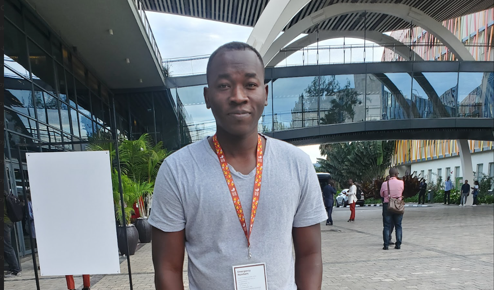

# My CV
Download my CV [here](https://drive.google.com/uc?export=download&id=1Xndrc1c09wFRtfyx5b3BSpxr7IldHnnl)

# Projects

## [Machine Learning](https://github.com/Detagnon2000/Machine-Learning)

## [Infectious diseases Modeling ( Malaria)](https://github.com/Detagnon2000/Infectious-Diseases-Modeling)

## [Web app to simulate an SIR model](https://z292kc-bernic-gbaguidi.shinyapps.io/Simulation_SIR_model/)

## [Genomics and Bioinformatic](https://github.com/Detagnon2000/Genomics-and-Bioinformatic)

